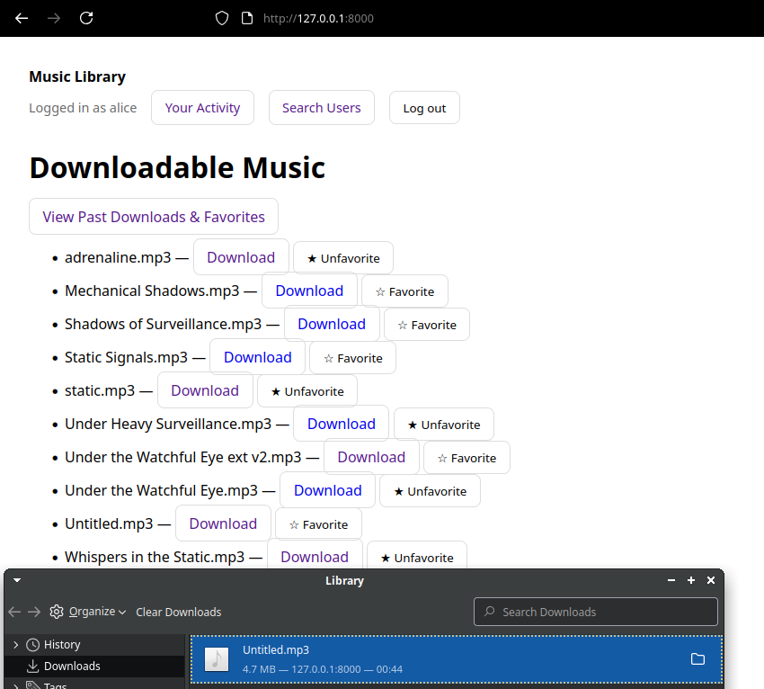

# Music Site - Django Web Application

This project is created for the [University of Helsinki Cyber Security Base 2025](https://cybersecuritybase.mooc.fi/) course project  
It demonstrates a simple music library web application written in Django. It is intentionally containing security flaws from the [OWASP Top 10 (2021)](https://owasp.org/Top10/).

---

## Features
- User authentication (login, logout)
- Browse available music files
- Download music
- Mark favorites
- Track user activity (downloads and favorites)
- Search for other users

## Existing Users
- username: alice | password: password123  
- username: bob   | password: password123  
- username: axel  | password: password123

---

## Security Flaws Demonstrated

### [Flaw 1: Broken Access Control (A01:2021)](https://github.com/ArcheshocK/music-site/blob/main/library/views.py#L39-L60)
- Any authenticated user can download any file, regardless of authorization.
- Example: alice has permission only for adrenaline.mp3 and static.mp3, but can download Untitled.mp3 (which only bob should access)
- Fix : add permission checks to restrict downloads to files authorized for the user.
- Note: The access control fix may still expose detailed error information due to DEBUG=True (see Flaw 4 fix).

**Screenshots:**
- 
- 

### [Flaw 2: Cross-Site Request Forgery (A02:2021)](https://github.com/ArcheshocK/music-site/blob/main/music_site/settings.py#L36-L49)
- CSRF middleware is disabled, so CSRF tokens are not validated even when present
- Fix: uncomment `CsrfViewMiddleware` in settings.py and remove `@csrf_exempt` decorators from login/logout views
- Django's CSRF protection works automatically when middleware is enabled - templates already include `` so no additional decorators needed
- **Note:** Due to Django's updated security defaults, login/logout views needed `@csrf_exempt` decorator to function while demonstrating this flaw. This workaround is required because course content is outdated compared to current Django security implementations.

**Screenshots:**
- 
- 

### [Flaw 3: SQL Injection (A03:2021)](https://github.com/ArcheshocK/music-site/blob/main/library/views.py#L82-L105)
- Raw SQL query is executed with unsanitized user input
- Fix: use Django ORM (`User.objects.filter(...)`) or parameterized queries

**Screenshots:**
- 
- 

### [Flaw 4: Security Misconfiguration (A05:2021)](https://github.com/ArcheshocK/music-site/blob/main/music_site/settings.py#L18-L23)
- `DEBUG = True` is enabled which exposes sensitive information if deployed in production
- Fix: set `DEBUG = False` in production

**Screenshots:**
- 
- 

### [Flaw 5: Identification and Authentication Failures (A07:2021)](https://github.com/ArcheshocK/music-site/blob/main/music_site/settings.py#L4-L13) [(login.html)](https://github.com/ArcheshocK/music-site/blob/main/templates/registration/login.html#L5-L7)

- no rate limiting or lockout for repeated failed login attempts
- suggested fix: integrate `django-axes` to block brute force login attempts

**Screenshots:**
- 
- 

---

## Installation & Running Locally

```bash
git clone https://github.com/ArcheshocK/music-site.git
cd music-site
python3 -m venv venv
source venv/bin/activate   # on Linux/Mac
# venv\Scripts\activate    # on Windows

pip install -r requirements.txt
python manage.py migrate
python manage.py runserver
```

Visit http://127.0.0.1:8000 to access the site

**Note:** Test users and file permissions are already included in the database for demonstrating security flaws.
